<!--
  Every image on this page is generated.
  Static (banner, project cards, toolbox): assets/src/build.mjs → assets/*.svg
  Live (status board, GitHub, Codeforces): .github/workflows/live.yml, hourly → the `output` branch
-->

<a href="https://ashfak.dev">
  <picture>
    <source media="(prefers-color-scheme: dark)" srcset="assets/banner-dark.svg">
    
  </picture>
</a>

<p align="center">
  <picture>
    <source media="(prefers-color-scheme: dark)" srcset="assets/status-dark.svg">
    
  </picture>
</p>

<p align="center">
  Final-year CS student and competitive programmer who builds backends that keep their promises under load.<br>
  Each project below proves one guarantee with a test or a load test, not an adjective.
</p>

## Featured work

<a href="https://github.com/Ashfak-Hossain/EchoAndAura">
  <picture>
    <source media="(prefers-color-scheme: dark)" srcset="assets/card-echoandaura-dark.svg">
    
  </picture>
</a>

<p align="center">
  <a href="https://github.com/Ashfak-Hossain/shortn"><picture><source media="(prefers-color-scheme: dark)" srcset="assets/card-shortn-dark.svg"></picture></a>
  <a href="https://github.com/Ashfak-Hossain/noOverlap"><picture><source media="(prefers-color-scheme: dark)" srcset="assets/card-nooverlap-dark.svg"></picture></a>
</p>

<picture>
  <source media="(prefers-color-scheme: dark)" srcset="https://raw.githubusercontent.com/Ashfak-Hossain/Ashfak-Hossain/output/live-status-dark.svg">
  
</picture>

## Engineering notes

Problems I found, measured and fixed. Click one to open it.

<details>
<summary><b>p99 from 172 ms to 11 ms with three lines of nginx</b> · shortn</summary>
<br>

Under steady load the median stayed at 1.6 ms but the tail kept growing. The API's own p99,
measured server-side, was about 5 ms, so the missing ~167 ms was spent outside the Go process.
nginx had no upstream `keepalive`: it opened a fresh TCP connection to an API container for every
request, and `TIME_WAIT` sockets piled up over the run.

```nginx
upstream shortn_api { keepalive 64; }      # keep idle connections to the API open
location / {
    proxy_http_version 1.1;                # keepalive needs HTTP/1.1
    proxy_set_header Connection "";        # nginx sends "Connection: close" upstream by default
}
```

Same 200 req/s, only nginx changed: **p99 172 ms → 11 ms**, median unchanged. A tail that moves
while the median doesn't is a queueing problem, not a compute one.
[Performance report →](https://github.com/Ashfak-Hossain/shortn/blob/master/docs/performance.md)

</details>

<details>
<summary><b>Making a double-booking impossible to write</b> · noOverlap</summary>
<br>

Check-then-insert has a race that no application code can close: two transactions both see the
slot free in the gap between the two statements. So the service stops checking, and the schema
makes an overlap unrepresentable:

```sql
EXCLUDE USING gist (listing_id WITH =, tstzrange(check_in, check_out, '[)') WITH &&)
  WHERE (status IN ('HELD', 'CONFIRMED'))
```

The service inserts and turns the rejection into a `409`. A hundred simultaneous holds on one slot
give **one 201 and ninety-nine 409s**; repeated a hundred times, 10,000 attempts leave **zero
overlapping rows** in the whole table. The half-open `[)` range lets a checkout and the next
check-in share a day.
[How it works →](https://github.com/Ashfak-Hossain/noOverlap/blob/master/docs/concepts/no-overlap.md)

</details>

<details>
<summary><b>A server that says "busy" instead of falling over</b> · EchoAndAura</summary>
<br>

Load-tested on two CPU cores pinned to the production server's size. Past about 80 page views a
second, requests queued inside Node until the heap filled, and at 220 a second the web process
crashed (`JavaScript heap out of memory`). The fix is load shedding at the edge: Traefik's
`inFlightReq` caps the requests in flight and answers `429` at once instead of queueing them. With
any cap the process never crashed, and its memory stayed near 250 MB.

Choosing the cap was the interesting part. A cap of 40 served page views best, but in an on-sale
rush it turned away 160 of 200 buyers while 60 seats stayed empty. A cap of 100 still can't crash
and lets the whole rush through: **200 buyers, 100 seats, exactly 100 holds, 0 oversold.**
[Load test →](https://github.com/Ashfak-Hossain/EchoAndAura/blob/main/docs/LOAD-TEST.md)

</details>

<details>
<summary><b>Admitting people at the door with no signal</b> · EchoAndAura</summary>
<br>

Venue signal fails exactly when a queue forms. The door phone keeps a copy of the event's ticket
list, refreshed every minute, with every ticket code stored only as a salted SHA-256 hash. When a
scan gets no answer, the phone judges it from that list (admit, already in, cancelled, not on this
list), marks the answer "offline" and queues the scan in an outbox. When the signal returns, the
outbox syncs oldest first, 50 scans per request, and the server replays each admit as a real
check-in. Two gates without signal can both admit one screenshot, so a double entry is recorded
and flagged for staff rather than trusted.
[ADR-034 →](https://github.com/Ashfak-Hossain/EchoAndAura/blob/main/docs/DECISIONS.md#adr-034--gate-scanner-offline-slice-b-a-hashed-list-an-outbox-double-entries-shown-not-prevented)

</details>

<details>
<summary><b>Exactly-once click analytics that never slow a redirect</b> · shortn</summary>
<br>

A redirect publishes a `LinkClicked` event to Redpanda and returns; it never waits for analytics.
A separate consumer writes each click to Postgres and commits the queue offset in the same
transaction as the insert, so a crash or restart can neither lose a click nor count one twice.
[Architecture →](https://github.com/Ashfak-Hossain/shortn/blob/master/ARCHITECTURE.md)

</details>

## Toolbox

<picture>
  <source media="(prefers-color-scheme: dark)" srcset="assets/stack-dark.svg">
  
</picture>

## Activity

<a href="https://github.com/Ashfak-Hossain?tab=repositories">
  <picture>
    <source media="(prefers-color-scheme: dark)" srcset="https://raw.githubusercontent.com/Ashfak-Hossain/Ashfak-Hossain/output/github-stats-dark.svg">
    
  </picture>
</a>

<a href="https://codeforces.com/profile/_Berlin_">
  <picture>
    <source media="(prefers-color-scheme: dark)" srcset="https://raw.githubusercontent.com/Ashfak-Hossain/Ashfak-Hossain/output/cp-stats-dark.svg">
    
  </picture>
</a>

<p align="center">
  Also on
  <a href="https://leetcode.com/user8670vw">LeetCode</a> ·
  <a href="https://www.codechef.com/users/evan42">CodeChef</a> ·
  <a href="https://www.hackerrank.com/evan1234_ek">HackerRank</a>
</p>

## Elsewhere

<p align="center">
  <a href="https://ashfak.dev"><b>ashfak.dev</b></a> ·
  <a href="https://linkedin.com/in/ashfak-hossain-evan">LinkedIn</a> ·
  <a href="https://twitter.com/ashfak_evan">X</a> ·
  <a href="https://stackoverflow.com/users/19765322">Stack Overflow</a> ·
  <a href="https://dev.to/berlin">dev.to</a>
</p>
